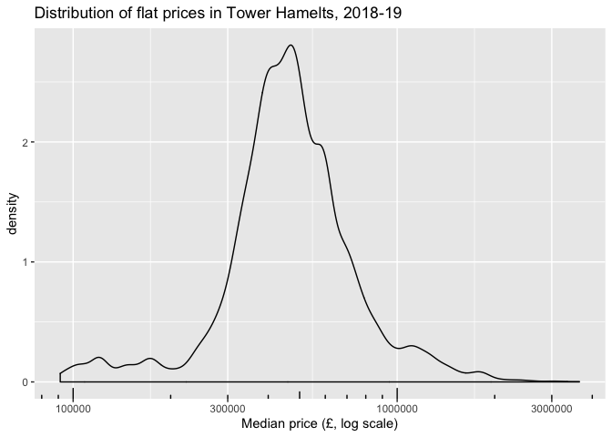
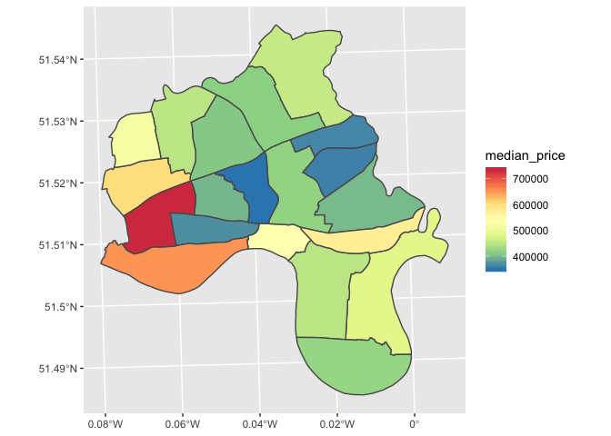
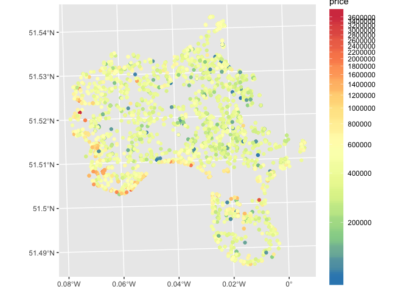
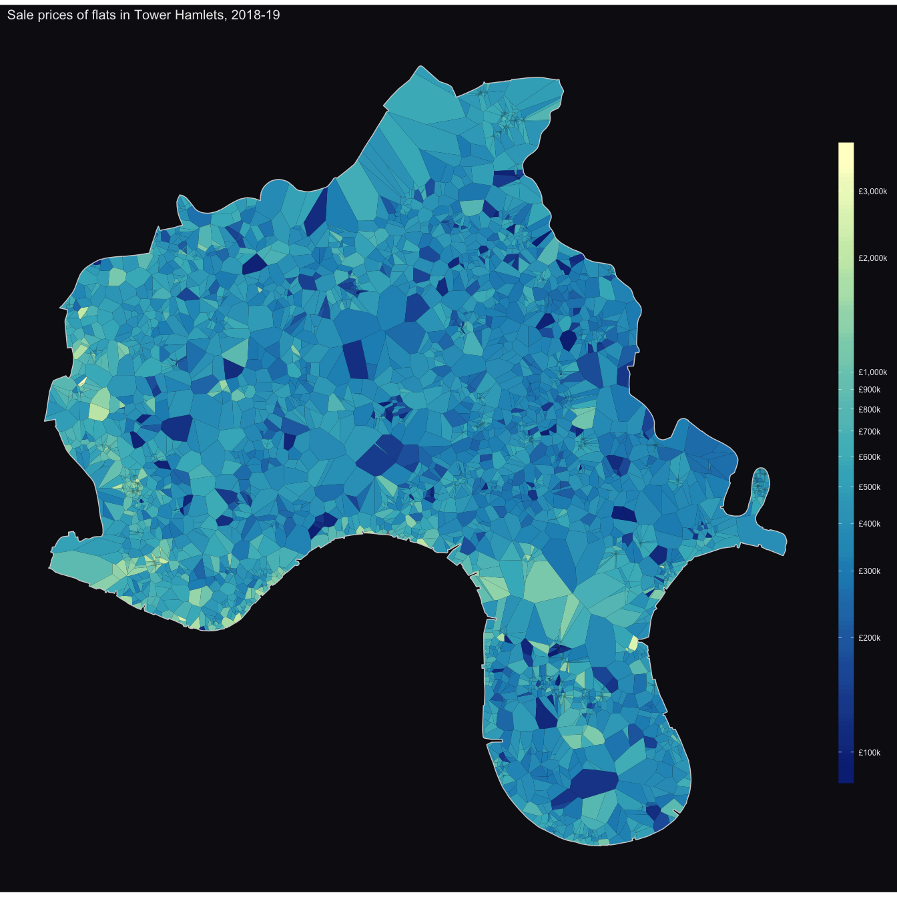
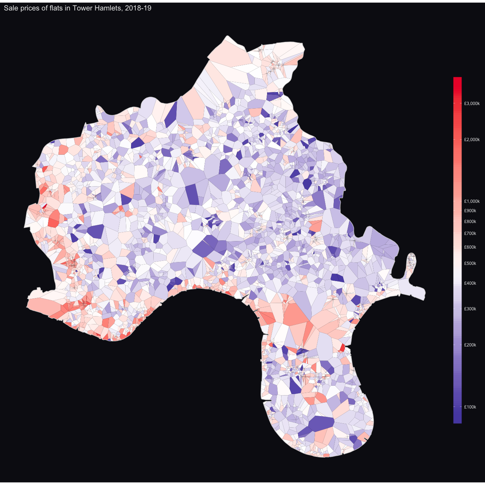
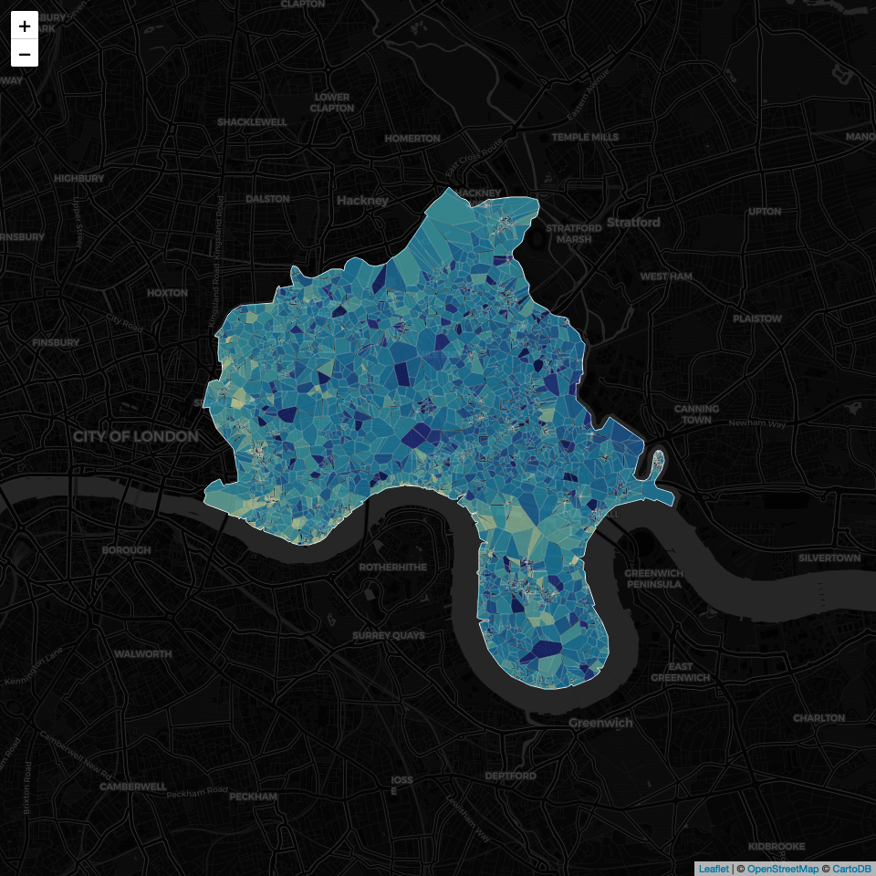
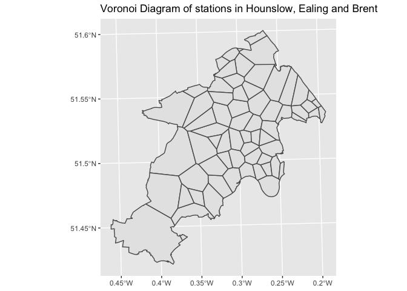
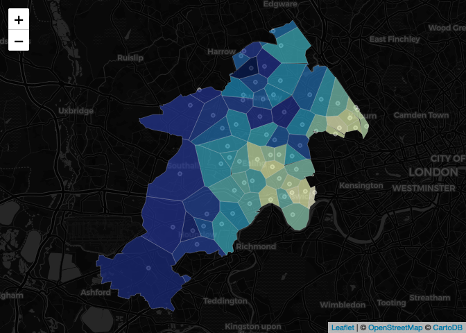

Using Voronoi Diagrams to Analyse Property Sales
================

Voronoi diagrams are a way of partitioning a plane into a series of
regions defined by the location of a set of points, often refered to as
‘seeds’. In a voronoi diagram, every seed is surrounded by a region
that covers the area of the plane that is closer to that seed than any
other. When these diagrams are overlaid onto maps or analysed alongside
other data, they can reveal valuable insights - for instance, voronoi
diagrams are used in sports analytics to identify how the movement of
football players can open or close down space; retailers use voronoi
diagrams to identify where they can open a new store with a large
population catchment.

Voronoi diagrams are easy to produce in R using the `sf` package. In
this post, I’ll be creating a voronoi diagram to analyse sales of flats
in Tower Hamlets, a borough of East London.

## The Data

The data comes from the Land Registry, who publish the details of every
property sale in the United Kingdom. It’s possible to download yearly
and historic files from
[here](https://www.gov.uk/government/statistical-data-sets/price-paid-data-downloads#yearly-file).

For this analysis, we’ll look at 2018 and 2019 sales only. Note that the
prices paid data records the property type of each transaction, coded as
“D” for detatched, “S” for semi-detatched, “T” for terrace, “F” for flat
and “O” for other. We’ll remove other from the data here.

``` r
library(tidyverse)

col_names <- c("Transaction unique identifier", "Price", "Date of Transfer", "Postcode",
               "Property Type", "Old/New", "Duration", "PAON", "SAON", "Street", 
               "Locality", "Town/City", "District", "County", "PPD Category Type", 
               "Record Status - monthly file only")
 
house_prices_2019 <- read_csv("pp-2019.csv", col_names = col_names)
house_prices_2018 <- read_csv("pp-2018.csv", col_names = col_names)

house_prices <- bind_rows(list(house_prices_2019, house_prices_2018))

house_prices <- house_prices %>% 
  janitor::clean_names() %>% 
  select("id" = 1, price, date_of_transfer, postcode, property_type, old_new, 
         "ppd_cat" =  ppd_category_type)

house_prices <- house_prices %>% 
  mutate(date_of_transfer = lubridate::ymd(date_of_transfer), 
         year_of_transfer = lubridate::year(date_of_transfer))

house_prices <- house_prices %>% filter(property_type %in% c("D", "S", "T", "F"))
```

**Extracting London’s Sales**

While the prices paid data contains the postcode of every property, it
is not geocoded. Fortunatly, there is a csv of every London postcode and
a rough latitude and longitude available to download
[here](https://www.doogal.co.uk/london_postcodes.php).

By using `inner_join()` on the `house_prices` and `postcodes` data, we
can return all records that occur in both datasets. This leaves us with
all property sales with a london postcode, which are also now geocoded.

``` r
postcodes <- data.table::fread("London postcodes.csv") %>% 
  select("postcode" = 1, "lat" = Latitude, "long" = Longitude) %>% 
  mutate(postcode = str_replace_all(postcode, " ", ""))

house_prices$postcode <- str_replace_all(house_prices$postcode, " ", "")

house_prices <- house_prices %>% 
  inner_join(postcodes, by = "postcode")
```

**Reading in shapefiles of London’s boroughs and wards**

We’ll want to visualise the property sales on a map, so we’ll also read
in two shapefiles - one of London’s 33 boroughs, and one of the
capital’s c. 630 wards.

``` r
library(sf)

london_boroughs <- read_sf("london map", "London_Borough_Excluding_MHW") %>% 
  select("la_name" = 1, "la_code" = 2) %>% 
  st_transform(crs = 27700)

london_wards <- read_sf("london wards", "London_Ward_CityMerged") %>% 
  select("ward_name"  = 1, "ward_code" = 2, "la_name" = 3, "la_code" = 4) %>% 
  st_transform(crs = 27700)
```

Finally, we’ll convert the house prices data to a spatial dataframe
object, so we can use the `sf` functions on the
data.

``` r
house_prices_sf <- st_as_sf(house_prices, coords = c("long", "lat"), crs = 4326) %>% 
  st_transform(crs = 27700)

house_prices_sf
```

    ## Simple feature collection with 178702 features and 8 fields
    ## geometry type:  POINT
    ## dimension:      XY
    ## bbox:           xmin: 504093.4 ymin: 156844 xmax: 559875.9 ymax: 199969.1
    ## epsg (SRID):    27700
    ## proj4string:    +proj=tmerc +lat_0=49 +lon_0=-2 +k=0.9996012717 +x_0=400000 +y_0=-100000 +ellps=airy +towgs84=446.448,-125.157,542.06,0.15,0.247,0.842,-20.489 +units=m +no_defs
    ## # A tibble: 178,702 x 9
    ##    id     price date_of_transfer postcode property_type old_new ppd_cat
    ##    <chr>  <dbl> <date>           <chr>    <chr>         <chr>   <chr>  
    ##  1 {858… 300000 2019-03-06       KT65AL   F             N       B      
    ##  2 {858… 395000 2019-03-04       SE61JX   T             N       B      
    ##  3 {858… 212500 2019-03-05       SE78ST   F             N       B      
    ##  4 {858… 350000 2019-02-22       SE155GW  T             N       B      
    ##  5 {858… 300000 2019-02-22       SE38HP   T             N       B      
    ##  6 {858… 605000 2019-03-01       SW82LP   F             N       B      
    ##  7 {858… 280000 2019-03-08       SE135EA  T             N       B      
    ##  8 {858… 280000 2019-02-12       SE62DQ   F             N       B      
    ##  9 {858… 320000 2019-03-13       SE115LU  F             N       B      
    ## 10 {858… 270000 2019-02-27       SW163RE  F             N       B      
    ## # … with 178,692 more rows, and 2 more variables: year_of_transfer <dbl>,
    ## #   geometry <POINT [m]>

## How much does a flat cost in Tower Hamlets?

Tower Hamlets is a large London borough that stretches from the edge of
the City of London in the west, to Canary Wharf and Stratford in the
east. The median price of a flat in Tower Hamlets is around £465,000.
Though as we can see from the density plot below, there’s a good deal of
variation in flat prices.

``` r
library(scales)

tower_hamlets_prices <- house_prices_sf %>% 
  filter(property_type == "F") %>% 
  st_intersection(london_boroughs %>% filter(la_name == "Tower Hamlets")) 

tower_hamlets_prices %>% 
  ggplot(aes(price)) + 
  geom_density() + 
  scale_x_log10() + 
  annotation_logticks(side = "b") +
  labs(title = "Distribution of flat prices in Tower Hamelts, 2018-19", 
       x = "Median price (£, log scale)")
```

<!-- -->

**Visualising the data**

One way of interogating the data is to summarise the flat prices by
ward, [a small(ish) unit of geography in the
UK](https://en.wikipedia.org/wiki/Wards_and_electoral_divisions_of_the_United_Kingdom).
We can see from the map below that flat prices are more expensive in the
west of Tower Hamlets, which borders on the City of London. However, we
can’t tell from this visulisation where the indivdual sales took place.
Nor can we tell how many sales there were in each ward or where in the
ward they took place.

More fundamentally, wards are an arbitary division of geography. They
don’t have any relationship with our data, and most Londoners would
struggle to tell you which ward they live in (by contrast, almost
everyone knows which Borough they live in).

``` r
tower_hamlets_prices %>% 
  st_join(x = london_wards %>% filter(la_name == "Tower Hamlets")) %>% 
  group_by(ward_name) %>% 
  summarise(median_price = median(price)) %>% 
  ggplot(aes(fill = median_price)) + 
  geom_sf() + 
  scale_fill_distiller(palette = "Spectral")
```

<!-- -->

We can resolve this to an extent by plotting the individual sales, but
there’s so much overlap between the points it’s difficult to pick out
any real trends here. It is noteworthy, however, that there are large
gaps in the map where no sales occured, likely due to these areas being
occupied by office blocks, retail spaces, green spaces or other
non-residential uses.

``` r
breaks <- c(seq(0, 4*10^6, 2*10^5))

tower_hamlets_prices %>% 
  ggplot(aes(color = price), alpha = 0.4) + 
  geom_sf() +
  scale_color_distiller(palette = "Spectral", trans = "log", breaks = breaks) +
  guides(color = guide_colorbar(ncol = 1, barheight = unit(120, units = "mm"))) 
```

<!-- -->

**Using a Voronoi Diagram**

Enter the Voronoi diagram. Using the `st_voronoi()` function from the
`sf` package, we can generate a new geometry based on where the sales
occured, allowing us to examine how concentrated sales are in particular
areas. When visualising the data, we can also color-code the Voronoi
cell according to sale price, which will reveal how prices vary in
different locations.

One thing to bear in mind is that Voronoi diagrams rely on unique
coordinates, which our data doesn’t have. As many properties share the
same postcode, they’ll have the same latitude and longitude. To remedy
this, we’ll apply a very small jitter to each point using the
`st_jitter()`
function.

``` r
tower_hamlets_jitter <- tower_hamlets_prices %>% st_jitter(factor = 0.001)
```

We can then create the Voronoi geometry using the code below.

``` r
tower_hamlets_voronoi <- tower_hamlets_jitter %>% 
  st_union() %>% 
  st_voronoi() %>% 
  st_collection_extract(type = "POLYGON") %>% 
  st_sf(crs = 27700) %>% 
  st_intersection(st_intersection(london_boroughs %>% filter(la_name == "Tower Hamlets")))

tower_hamlets_voronoi <- tower_hamlets_voronoi %>% st_join(tower_hamlets_jitter)
```

We can then visualise the data using `geom_sf()`. The resulting
visualisation makes a couple trends clearer than the previous dot plot
and choropleth.

First, looking at the south of the outline of Tower Hamlets, which
borders the river Thames, we can see a narrow band of very expensive
flats. These flats, located on the river, generally sold for more than
£1 million.

Second, we can see that there are quite a few sales of flats for
somewhere between £100,000 and £200,000 in the Borough - a steep
discount from the median flat price. It looks as though there were more
of these sales in the far east of Tower Hamlets, which borders on
Statford; and in the very South, in an area called Millwall.

Third, looking closely there are some highly concentrated areas where
many properties close together were transacted - this is possibly due to
new flats in a development being brought to market, which may have all
been sold around the same time.

``` r
library(JLLify)

tower_hamlets_map <- london_boroughs %>% filter(la_name == "Tower Hamlets")

breaks <- c(seq(0, 10^6, 10^5), seq(2*10^6, 5*10^6, 10^6))

tower_hamlets_voronoi %>% 
  ggplot() + 
  geom_sf(aes(fill = price), col = NA) +
  geom_sf(data = tower_hamlets_map, fill = NA, color = "lightgrey") + 
  scale_fill_distiller(name = "", palette = "YlGnBu", trans = "log", breaks = breaks, 
                       labels = dollar_format(prefix = "£", accuracy = 1, scale = 0.001, suffix = "k")) +
  guides(fill = guide_colorbar(ncol = 1, barheight = unit(10, units = "inches"))) + 
  theme_map_dark() +
  theme(legend.position = "right") + 
  labs(title = "Sale prices of flats in Tower Hamlets, 2018-19")
```

<!-- --> An
alternative way of visualising the data is to use a diverging color
scheme centered around the median flat price. Here, we can see in red
the concentration of sales above the median flat price in the western
and southern parts of Tower Hamlets, compared with greater concentration
of blue tones in the east.

``` r
median_price <- median(tower_hamlets_prices$price) 

tower_hamlets_voronoi %>% 
  ggplot() + 
  geom_sf(aes(fill = price), col = NA) +
  geom_sf(data = tower_hamlets_map, fill = NA, color = "lightgrey") + 
  scale_fill_gradient2(name = "", midpoint = log(median_price), 
                      low = "#04249C", high = "#EC2434",
                      trans = "log", breaks = breaks,
                      labels = dollar_format(prefix = "£", accuracy = 1, scale = 0.001, suffix = "k")) +
  guides(fill = guide_colorbar(ncol = 1, barheight = unit(10, units = "inches"))) + 
  theme_map_dark() +
  theme(legend.position = "right") + 
  labs(title = "Sale prices of flats in Tower Hamlets, 2018-19")
```

<!-- -->

We can easilly take our Voronoi geometry and overlay it onto a map using
the `leaflet` package. This has the added benefit that we can use a
tooltip to surface the price of any transaction when we hoover over the
geometry. This makes it easier to pick out the extreme values, including
flats which sold for c. £90,000 - around 20% of the median flat price.

``` r
library(leaflet)

color_pal <- colorNumeric(log(tower_hamlets_voronoi$price), palette = "YlGnBu", reverse = TRUE)

tower_hamlets_voronoi %>% 
  st_transform(crs = 4326) %>% 
  leaflet() %>% 
  addProviderTiles(provider = providers$CartoDB.DarkMatter) %>% 
  addPolygons(data = st_transform(tower_hamlets_map, crs = 4326), 
              fillOpacity = 0, opacity = 1, weight = 1, 
              color = "white") %>% 
  addPolygons(fillColor = ~color_pal(log(price)), color = "lightgrey", 
              weight = 0.2, opacity = 1, fillOpacity = 0.7,
              label = ~paste0("Sale price: ", dollar(price, prefix = "£")))
```

<!-- -->

## Using Stations as the Voronoi Seeds

An alternative approach to the above method is to use stations as the
seeds of the Voronoi diagrams, and then agregate property transactions
within each of the Voronoi cells. In many ways, this is a more for
intuitive way of analysing locations - people tend to be much more
familar with the area around their closest station than they would be
with the borough or ward they live in, and will often look to move to or
buy a property close to a station that offers them an easier commute.

Doogle.co.uk provides a full list of all the stations in London,
incluing both underground, overground and mainline stations. We’ll read
this in
now.

``` r
stations <- read_csv("https://www.doogal.co.uk/LondonStationsCSV.ashx") %>% 
  select("station" = 1, "x" = 2, "y" = 3) %>% 
  st_as_sf(coords = c("x", "y"), crs = 27700)
```

**How much does a flat cost in west London?**

Hounslow, Ealing and Brent are three boroughs located in outer west
London. These areas encompass a broad range of neighbourhoods -
including locations like Feltham, which boarders Heathrow airport;
Chiswick, a leafy suburb on the river Thames; and Queens Park, a
highly-desirable and expensive area north of Kensington.

We’ll here create a new Voronoi diagram using the stations located in
these three London boroughs. This divides the boroughs into Voronoi 65
cells, one for each station.

``` r
west_map <- london_boroughs %>% 
  filter(la_name %in% c("Hounslow","Ealing","Brent")) %>% 
  st_union()

stations_west <- stations %>% st_intersection(west_map) 

west_voronoi <- stations_west %>% 
  st_union() %>% 
  st_voronoi() %>% 
  st_collection_extract(type = "POLYGON") %>% 
  st_sf(crs = 27700) %>% 
  st_intersection(west_map) %>% 
  st_join(stations_west)

west_voronoi %>% 
  ggplot() + 
  geom_sf() + 
  labs(title = "Voronoi Diagram of stations in Hounslow, Ealing and Brent")
```

<!-- -->

We’ll now join this Voronoi diagram with the housing trabnsactions,
looking again only at sales of flats, which are coded “F” in the data.
For each station, we’ll calculate the median house price and number of
sales in the surrounding area.

``` r
west_voronoi <- west_voronoi %>% 
  st_join(house_prices_sf %>% filter(property_type == "F"))

west_voronoi_summarised <- west_voronoi %>% 
  group_by(station) %>% 
  summarise(price = median(price),
            number_sales = n()) %>% 
  ungroup()
```

We’ll again use leaflet to visualise the Voronoi diagram. Note that the
dots here show the location of the
stations.

``` r
color_pal <- colorNumeric(log(west_voronoi_summarised$price), palette = "YlGnBu", reverse = TRUE)

west_voronoi_summarised %>% 
  st_transform(crs = 4326) %>% 
  leaflet() %>% 
  addProviderTiles(provider = providers$CartoDB.DarkMatter) %>% 
  addCircles(data = st_transform(stations_west, 4326), color = "white") %>% 
  addPolygons(fillColor = ~color_pal(log(price)), color = "white",
              weight = 0.2, opacity = 1, fillOpacity = 0.7,
              label = ~paste0(
                station, "<br>",
                "Sale price: ", dollar(price, prefix = "£"), "<br>",
                "Number of sales: ", comma(number_sales)) %>% lapply(htmltools::HTML)
              )
```

<!-- -->

The main take-away here is that locations in the west of the diagram
(such as Feltham, Southhall and Northhold) are considerably cheaper than
locations in the west (such as Turnham Green, Chiswick Park and Kensal
Rise).

However, the more interesting cells are those whose colors contrast with
their immediate neighbours. On this reading, Gunnersbury, with a median
price of £426,000, looks cheap compared to neighbouring Kew Bridge and
Chiswick Park, where median prices in 2018/19 where £530,000 and
£590,000 respectivly. Similarly, the median flat price in Willesden
Green was £435,000, compared with £369,000 in neighbouring Dollis Hill.

Ealing Broadway, where the median flat price was £514,000, looks
expensive compared to its neighbouring Voronoi cells, though this may be
due to the station being serverd by both the Central and District
underground lines, as well as national services.
